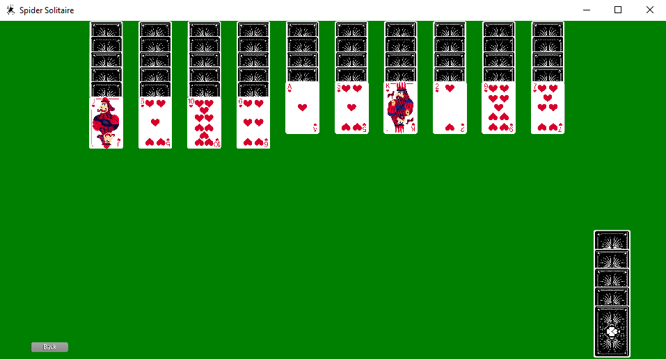

# Spider Solitaire
Simple one colored version of the game (for now).

## Dynamic of the game
___
+ The point of the game is to stack all of the cards in descending order, grouped by their decks.
+ There are 10 fields of cards in the upper region of the screen. The first 4 fields are filled with 11 cards each and the other 6 fields are filled with 10 cards each. Only the most upper card in each field is faced up, others are faced down. There are 5 stacks of 10 cards at the bottom right of the screen, which are faced down. 
+ That equivalents to 104 cards or 8 full decks of cards. The values are {A, K, Q, J, 10, 9, 8, 7, 6, 5, 4, 3, 2}. To complete a full stack they have to be sorted in that manner. The completed stacks go on the right side of the screen.
+ If the upper stack cannot be completed, you can get 10 cards from the bottom stacks. 
If the stacks cannot be completed and you don't have any cards left in the bottom stacks, the game is OVER.
If you try to move cards from the upper stacks that arent of proper order, you CANNOT move them.

## Mechanics of the game 
___
- Movement of the cards.
- New cards from stack facing down.
- Full stacks get send to a pile.
- Checking proper values (Descencind order).
- Score
- Nr. of moves

## Elements of the game
___
- All 13 card Textures, background, back textures of the cards.
- Click sounds, invalid movement sounds, stack sounds, dealing sounds....
- Logic (card movement, collision, mouse movement, ending particles/animation, particles)...

## Game Example
___
- Screenshot
 

- Video 
 